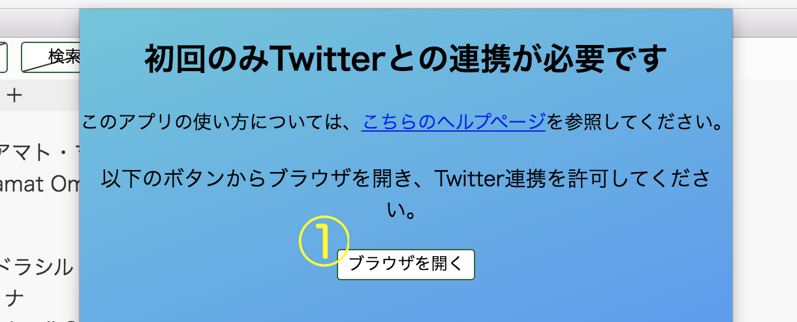
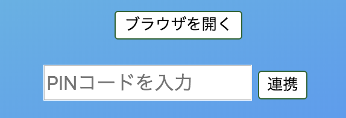
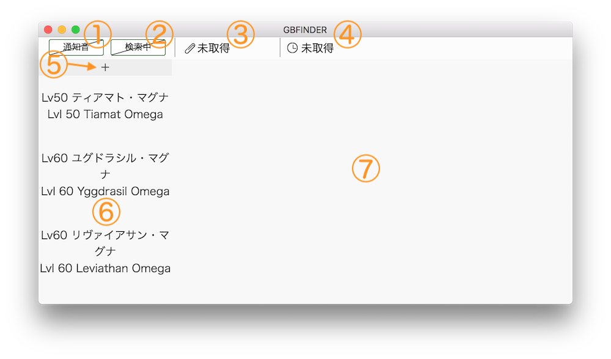
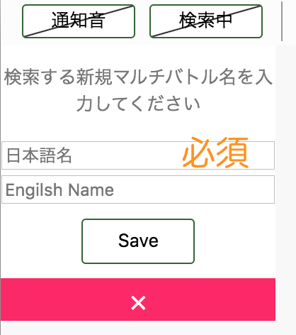

## 注意

使用は自己責任でお願いします。
{: .text-center}

## ダウンロードについて

ダウンロードはこちらのGoogleドライブのリンクから行えます。

* [gbfinder - Google Drive](https://drive.google.com/drive/folders/1YwuV6jWlZU9plWkLeGJUsA3COytoDoBT?usp=sharing)
    * macOS版: gbfinder-darwin-x64.zip
    * linux版: gbfinder-linux-x64.zip
    * windows 32bit版: gbfinder-win32-ia32.zip
    * windows 64bit版: gbfinder-win32-x64.zip

## Twitter認証について

ダウンロードした後、ダブルクリックなどで起動すると、最初は以下のような表示が現れます。

Twitterのツイートを検索（収集）するためには、あなたが普段使っているブラウザでこのアプリを認証する必要があります。

{: .img-fluid}

1. この`ブラウザを開く`ボタンを押すと、普段お使いのブラウザが開き、ツイッターのログイン画面もしくは当アプリを許可するかどうかの表示が現れます。以下のように表示されます。
ログイン画面の場合は、ログインすることで、表示されます。

{: .img-fluid}

権限（実際にはどれも行いませんが）についてご納得いただき、認証ボタンを押すことで、PINコードが表示されます。

{: .img-fluid}

アプリに戻り、このPINコードを入力して、`連携`ボタンを押すことで、Twitter連携は完了です。

{: .img-fluid}

PINコード入力箇所は、ブラウザを開くボタンの下に現れます。

## 認証後のメイン画面

ツイッター認証後は、以下のような画面が最初から表示されます。

{: .img-fluid}

1. このボタンを押すことで、クリップボードへ自動コピーした時に、音を鳴らすかどうか設定できます。
2. ツイートを収集している最中かどうかを示しています。収集している最中の時、このボタンを押すことで、収集を中止することができます。
3. 最後にコピーした参戦IDを表示します。
4. 最後にオートコピーからの経過時間を大まかに表示します。
5. この`+`ボタンを押すことでマルチバトルを新規追加することができます。詳しくは後述にて。
6. 検索できるマルチバトルの一覧です。スクロール可能で、検索したい項目をクリックすることで、ツイートを収集開始します。
7. 収集したツイートを表示する領域です。

## ツイートの表示について

新規ツイートは、左上に追加されるため、左上ほど新しく、右下ほど古いツイートになります。
下部画像はツイート表示の例です。

{: .img-fluid}

## 新規マルチバトルの追加について

日本語名が必須項目となっています。また、日本語名の箇所に`English Name`を入力しても構いません。

{: .img-fluid .mx-auto}

`Save`ボタンを押すことで、リストの最上部に保存されます。
`×`ボタンで追加を中止することができます。

## PC内で使用する領域について

当アプリは、マルチバトルのリストなどをPC内部に保存するため、PCのストレージの一部を利用します。

使用するフォルダは、メニューの`File -> 設定ファイル保存用のフォルダを開く`をクリックすることで表示できます。

## 使用している素材の出典

* 効果音: https://taira-komori.jpn.org/freesound.html
* クリップと時計のアイコン: https://cssicon.space/#/